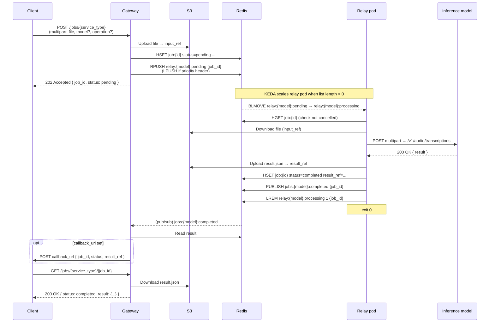

# Async flow

```mermaid
sequenceDiagram
    participant C as Client
    participant GW as Gateway
    participant S3 as S3
    participant RDB as Redis
    participant RL as Relay pod
    participant INF as Inference model

    C->>GW: POST /jobs/{service_type}<br/>(multipart: file, model?, operation?)
    GW->>S3: Upload file → input_ref
    GW->>RDB: HSET job:{id} status=pending ...
    GW->>RDB: RPUSH relay:{model}:pending {job_id}<br/>(LPUSH if priority header)
    GW-->>C: 202 Accepted { job_id, status: pending }

    Note over RDB,RL: KEDA scales relay pod when list length > 0

    RDB-->>RL: BLMOVE relay:{model}:pending → relay:{model}:processing
    RL->>RDB: HGET job:{id}  (check not cancelled)
    RL->>S3: Download file (input_ref)
    RL->>INF: POST multipart → /v1/audio/transcriptions
    INF-->>RL: 200 OK { result }
    RL->>S3: Upload result.json → result_ref
    RL->>RDB: HSET job:{id} status=completed result_ref=...
    RL->>RDB: PUBLISH jobs:{model}:completed {job_id}
    RL->>RDB: LREM relay:{model}:processing 1 {job_id}
    Note over RL: exit 0

    RDB-->>GW: (pub/sub) jobs:{model}:completed
    GW->>RDB: Read result
    opt callback_url set
        GW->>C: POST callback_url { job_id, status, result_ref }
    end

    C->>GW: GET /jobs/{service_type}/{job_id}
    GW->>S3: Download result.json
    GW-->>C: 200 OK { status: completed, result: {...} }
```
