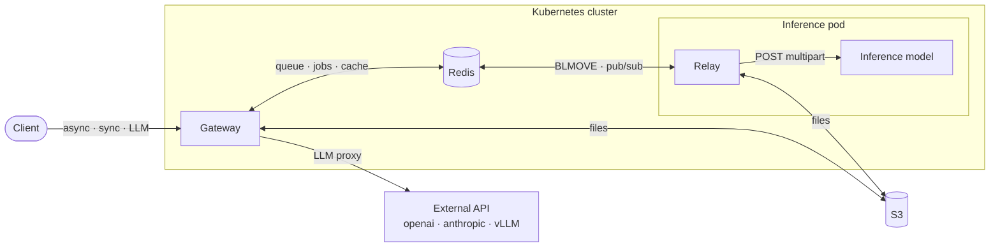

# Architecture overview

```mermaid
graph LR
    C([Client])

    subgraph K8s[Kubernetes cluster]
        GW[Gateway]
        RDB[(Redis)]

        subgraph Pod[Inference pod]
            RL[Relay]
            INF[Inference model]
        end
    end

    S3[(S3)]
    EXT["External API\nopenai · anthropic · vLLM"]

    C -->|"async · sync · LLM"| GW

    GW <-->|"queue · jobs · cache"| RDB
    GW <-->|files| S3
    GW -->|"LLM proxy"| EXT

    RDB <-->|"BLMOVE · pub/sub"| RL
    RL <-->|files| S3
    RL -->|"POST multipart"| INF
```
