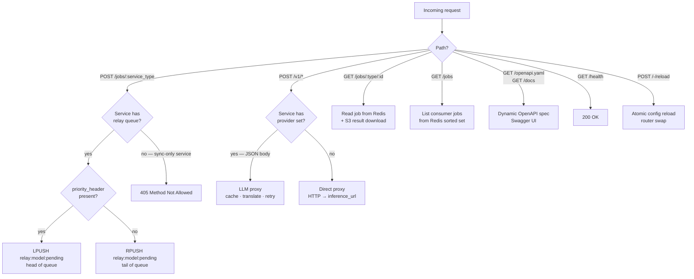

# Routing decision

```mermaid
flowchart TD
    REQ[Incoming request] --> PATH{Path?}

    PATH -->|"POST /jobs/:service_type"| ASYNC_CHECK

    ASYNC_CHECK{"Service has\nrelay queue?"}
    ASYNC_CHECK -->|yes| PRIORITY{"priority_header\npresent?"}
    ASYNC_CHECK -->|"no — sync-only service"| HTTP405[405 Method Not Allowed]

    PRIORITY -->|yes| LPUSH["LPUSH relay:model:pending\nhead of queue"]
    PRIORITY -->|no| RPUSH["RPUSH relay:model:pending\ntail of queue"]

    PATH -->|"POST /v1/*"| SYNC_CHECK{"Service has\nprovider set?"}

    SYNC_CHECK -->|"yes — JSON body"| LLM["LLM proxy\ncache · translate · retry"]
    SYNC_CHECK -->|no| PROXY["Direct proxy\nHTTP → inference_url"]

    PATH -->|"GET /jobs/:type/:id"| JOB_READ["Read job from Redis\n+ S3 result download"]
    PATH -->|"GET /jobs"| JOB_LIST["List consumer jobs\nfrom Redis sorted set"]
    PATH -->|"GET /openapi.yaml\nGET /docs"| SPEC["Dynamic OpenAPI spec\nSwagger UI"]
    PATH -->|"GET /health"| HEALTH[200 OK]
    PATH -->|"POST /-/reload"| RELOAD["Atomic config reload\nrouter swap"]
```
